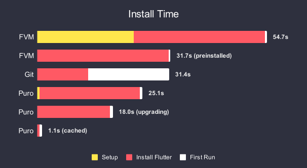
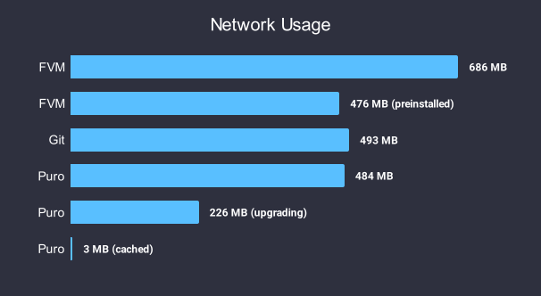
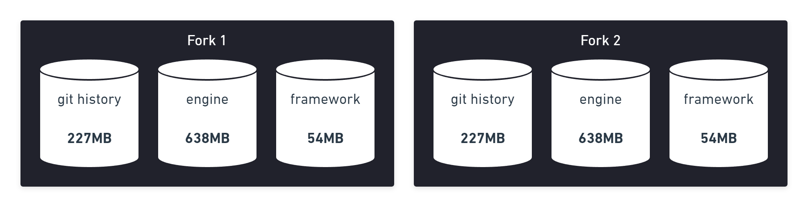
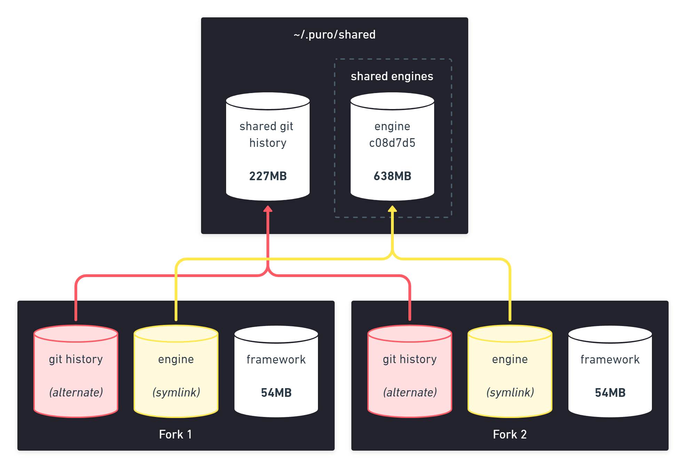

# About

Puro is a powerful tool for installing and upgrading [Flutter](https://flutter.dev/) versions, it is essential for
developers that work on multiple projects or have slower internet.

With Puro you can:

* Use different versions of Flutter at the same time
{ ^ .star-list }
* Download new versions twice as fast with significantly less disk space and internet bandwidth
* Use versions globally or per-project
* Automatically configure IDE settings with a single command

## Installation

=== "Windows"

    Puro can be installed on Windows with PowerShell (as your current user, **do not use administrator**):

    ```ps1
    Invoke-WebRequest -Uri "https://puro.dev/builds/master/windows-x64/puro.exe" -OutFile "$env:temp\puro.exe"; &"$env:temp\puro.exe" install-puro --promote
    ```

    Or as a standalone executable (not recommended):

    [:material-console: Standalone](https://puro.dev/builds/master/windows-x64/puro.exe){ .md-button }

    ---
        
    note: Flutter requires [git](https://git-scm.com/) which can be installed at [https://git-scm.com/download/win](https://git-scm.com/download/win)

=== "Linux"

    Puro can be installed on Linux with the following command:

    ```sh
    curl -o- https://puro.dev/install.sh | PURO_VERSION="master" bash
    ```

    Or as a standalone executable (not recommended):

    [:material-console: Standalone](https://puro.dev/builds/master/linux-x64/puro){ .md-button }

    ---

    note: Flutter requires [git](https://git-scm.com/) which can be installed with most package managers e.g. apt:

    ```sh
    sudo apt install git
    ```

=== "Mac"

    Puro can be installed on Mac with the following command:

    ```sh
    curl -o- https://puro.dev/install.sh | PURO_VERSION="master" bash
    ```

    Or as a standalone executable (not recommended):

    [:material-console: Standalone](https://puro.dev/builds/master/darwin-x64/puro){ .md-button }

    ---

    note: Flutter requires [git](https://git-scm.com/) which can be installed with [Homebrew](https://brew.sh/) for macOS:

    ```sh
    brew install git
    ```

<script src="/javascript/os_detect.js"></script>

## Quick Start

After installing Puro you can run `puro flutter doctor` to install the latest stable version of Flutter, if you want to
switch to beta you can run `puro use -g beta` and then `puro flutter doctor` again.

And that's it, you're ready to go!

Puro uses the concept of "environments" to manage Flutter versions, these can either be tied to a specific version /
release channel, or a named environment that can be upgraded independently.

Environments can be set globally or per-project, the global environment is set to `stable` by default.

Cheat sheet:

```
# Create a new environment "foo" with the latest stable release
puro create foo stable

# Create a new environment "bar" with with Flutter 3.13.6
puro create bar 3.13.6

# Switch "bar" to a specific Flutter version
puro upgrade bar 3.10.6

# List available environments
puro ls

# List available Flutter releases
puro releases

# Switch the current project to use "foo"
puro use foo

# Switch the global default to "bar"
puro use -g bar

# Remove puro configuration from the current project
puro clean

# Delete the "foo" environment
puro rm foo

# Run flutter commands in a specific environment
puro -e foo flutter ...
puro -e foo dart ...
puro -e foo pub ...
```

See the full command list at https://puro.dev/reference/manual/

## Performance

Puro implements a few optimizations that make installing Flutter as fast as possible.
First-time installations are 20% faster while improving subsequent installations by a whopping 50-95%:



This also translates into much lower network usage:



## How it works

Puro achieves these performance gains with a few smart optimizations:

* Parallel git clone and engine download
* Global cache for git history
* Global cache for engine versions

With other approaches, each Flutter repository is in its own folder, requiring you to download and store the git history, engine, and framework of each version:



Puro implements a technology similar to GitLab's [object deduplication](https://docs.gitlab.com/ee/development/git_object_deduplication.html) to avoid downloading the same git objects over and over again. It also uses symlinks to share the same engine version between multiple installations:


